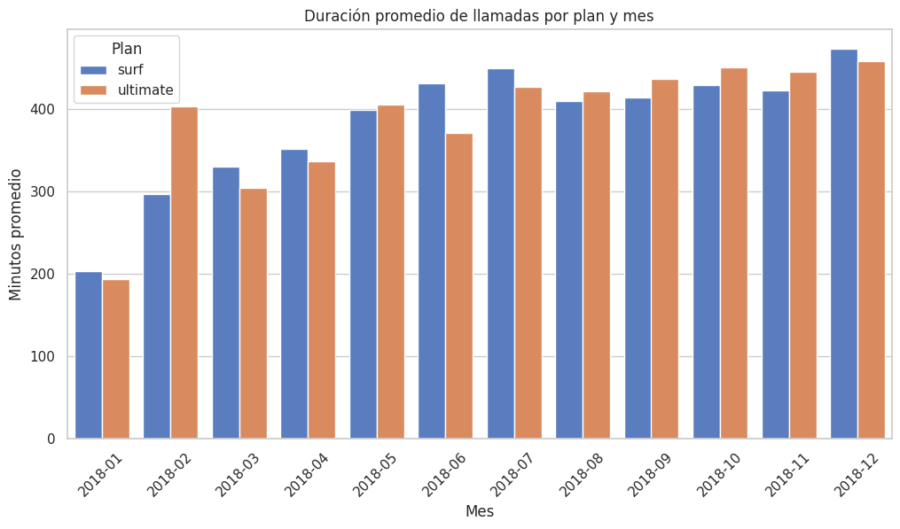
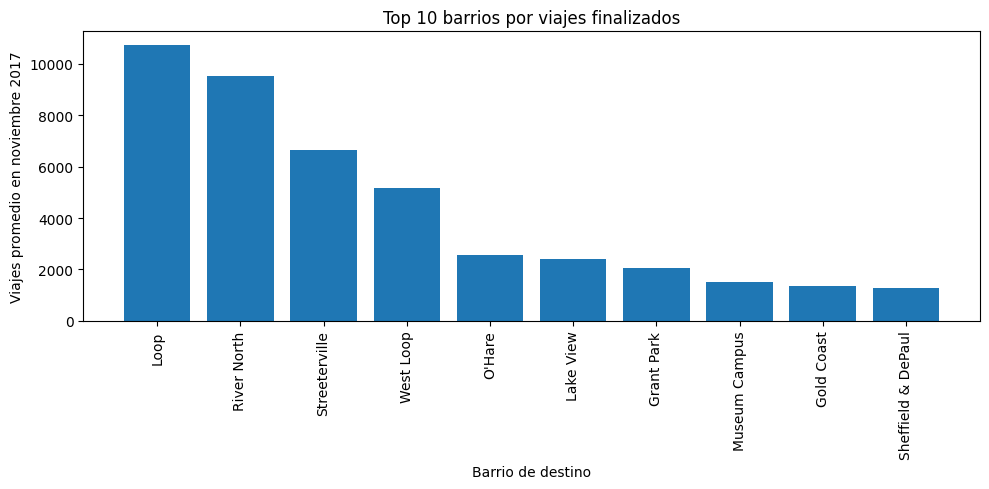

📈 Sobre mí

Soy Ingeniera Industrial en transición hacia Data Analytics, con experiencia previa en procesos, mejora continua, calidad y análisis.

Actualmente desarrollando proyectos con Python, SQL y visualización para portafolio profesional 👩‍💻

Intereses:
✨ Data Analytics
✨ Machine Learning
✨ Procesos
✨ Consultoría

📬 Contacto

📧 Correo: brenishdez@gmail.com
🔗 LinkedIn: [brenis-hernandez](https://www.linkedin.com/in/brenis-hernandez/)
📂 GitHub: [Repositorio Github](https://github.com/brenishdez-analyst/brenishdez.github.io)

🧩 Cómo se desarrollan mis proyectos

Uso un enfoque basado en:

* Ciclo de análisis
* Formulación de hipótesis
* EDA
* Pruebas estadísticas
* Comunicación de resultados

Esto asegura un análisis profesional y reproducible ✨

🚀 Objetivo Profesional

Seguir desarrollándome como Data Analyst en proyectos que involucren análisis estadístico, Machine Learning básico, visualización avanzada y soluciones para negocio.

📊 Portafolio de Proyectos – Data Analytics

Aquí encontrarás una selección de mis proyectos desarrollados usando Python, SQL, Pandas, visualizaciones y análisis estadístico.

✨ Tecnologías principales

* Python (Pandas, Numpy, Matplotlib, Scipy)
* SQL
* Jupyter Notebook
* Estadística
* Visualización de datos

📁 Proyectos

🟦 1) Análisis Estadístico de Datos

Exploración estadística, pruebas de hipótesis, análisis exploratorio y visualizaciones.

Objetivo: Analizar el comportamiento de los viajes en función de las condiciones climáticas y determinar si existen diferencias significativas en la duración promedio.

Lo que hice:

* Limpieza de datos ✔
* EDA (Exploratory Data Analysis)
* Pruebas t para comparar grupos
* Visualización personalizada con Matplotlib
* Interpretación técnica y “no técnica”

Habilidades aplicadas:

* Pandas, Matplotlib, Scipy.stats
* Estadística inferencial
* Tratamiento de outliers

Highlights:

* Reduje tiempos de análisis automatizando cálculos
* Logré comunicar insights en formato narrativo técnico y entendible

👉 **Link al detalle del Proyecto:** [Análisis estadístico](https://github.com/brenishdez-analyst/brenishdez.github.io/blob/main/An%C3%A1lisis%20estad%C3%ADstico%20de%20datos.ipynb)

🟩 2) Análisis de Patrones de Comportamiento

Identificación de tendencias, segmentación y comportamiento de usuarios.

Objetivo: Encontrar patrones relevantes dentro de un dataset para describir el comportamiento de los usuarios y detectar posibles áreas de oportunidad.

Lo que hice:

* Normalización y preparación de datos
* Análisis descriptivo y tendencias
* Segmentaciones y patrones
* Visualizaciones claras y comparativas

Habilidades aplicadas:

* Python
* Limpieza y estructuración de datos
* Análisis exploratorio

Highlights:

* Identifiqué patrones clave para decisiones de negocio
* Profundicé en visualización narrativa (data storytelling)

👉 **Link al detalle del Proyecto:** [Análisis de patrones] (https://github.com/brenishdez-analyst/brenishdez.github.io/blob/main/Analisis%20de%20patrones%20de%20comportamiento.ipynb)